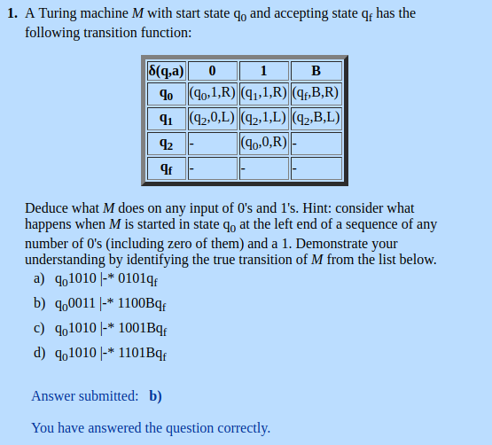
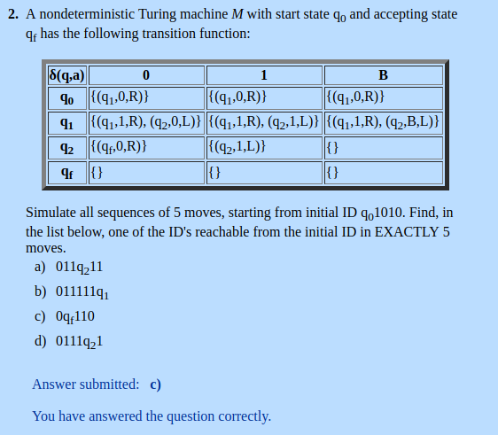
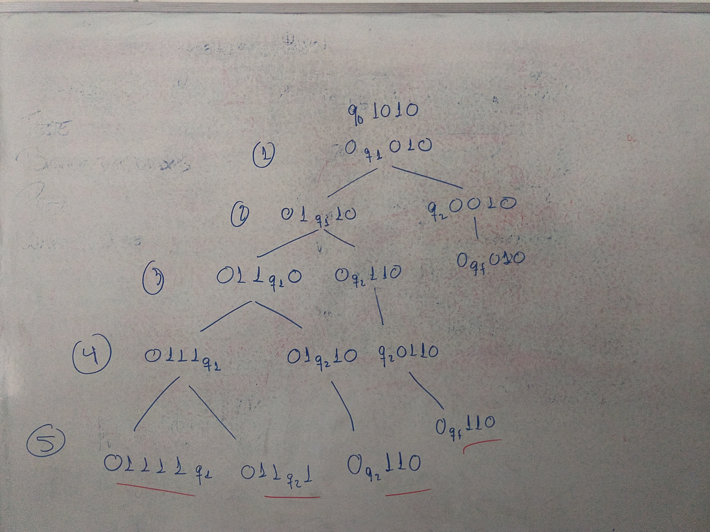
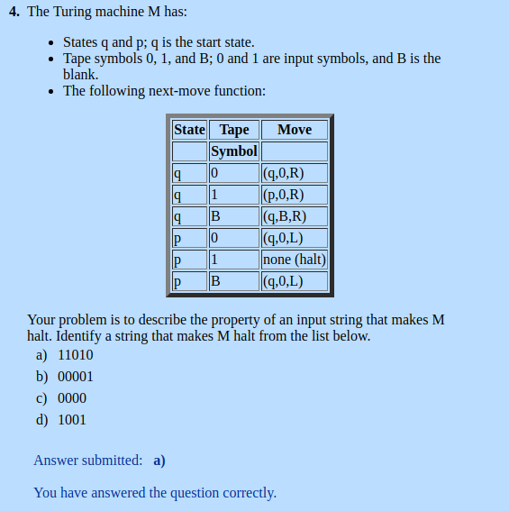
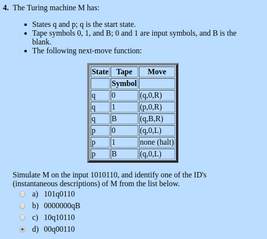

# Chapter 09: Undecidabilty
# ou
# Maquinas de Turing, Conjuntos Recursivos e R.E. , Teorema de Rice

  

Troca 0 por 1  
Troca 1 por 0  
Acaba escrevendo B e estado final no fim da string

---  

  

Em 5 passos pode acabar em qualquer um desses 4 mostrados na imagem  
  

---  

  
Para(halt) quando encontra dois 1 seguidos (ou seja quando encontra "11")  

---  

  

Para descobrir as erradas basta usar essas duas informações:  
**1)** Essa máquina substitui 1 por 0 e 0 por 0, ou seja, deixa 0 por onde passa  
**2)** Da Halt se encontra 11  

Utilizando a primeira informação você elimina qualquer alternativa que tiver 1 atrás do estado atual  
Utilizando a segunda informação você sabe que essa máquina não tem como passar da parte que tem "11", então se alguma delas passou dessa parte então você pode eliminar  

101q0110 - tem 1 antes do q, elimina por causa da informação **1**  
0000000qB - passou de onde 11, elimina por causa da informação **2**  
10q10110 - tem 1 antes do q, elimina por causa da informação **1**    
