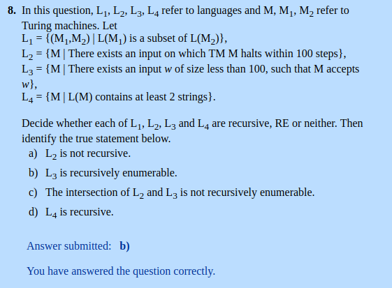

# Chapter 09: Undecidabilty
# ou
# Maquinas de Turing, Conjuntos Recursivos e R.E. , Teorema de Rice

  

  

  

  

---  

  

($, $\*) - incorreto  
(\*$, $) - incorreto  
(0\*1, \*0\*1\*0) - incorreto  
(0\*1\*, \*0\*1\*0\*) - incorreto  
(1\*1, \*1\*1\*0) - incorreto  
(\*1\*1, 1\*1\*0\*) - incorreto  
(\*0\*1, 0\*1\*0\*) - incorreto  
(\*1\*1\*, \*1\*1\*0) - incorreto  

(0\*1\*, \*0\*1\*0) - correto  
(\*0\*1\*, \*0\*1\*0) - correto  

---

  

Troca 0 por 1  
Troca 1 por 0  
Acaba escrevendo B e estado final no fim da string

---  

  

Em 5 passos pode acabar em qualquer um desses 4 mostrados na imagem  
  

---  

  
Para(halt) quando encontra dois 1 seguidos (ou seja quando encontra "11")  

---  

  

Para descobrir as erradas basta usar essas duas informações:  
**1)** Essa máquina substitui 1 por 0 e 0 por 0, ou seja, deixa 0 por onde passa  
**2)** Da Halt se encontra 11  

Utilizando a primeira informação você elimina qualquer alternativa que tiver 1 atrás do estado atual  
Utilizando a segunda informação você sabe que essa máquina não tem como passar da parte que tem "11", então se alguma delas passou dessa parte então você pode eliminar  

101q0110 - tem 1 antes do q, elimina por causa da informação **1**  
0000000qB - passou de onde 11, elimina por causa da informação **2**  
10q10110 - tem 1 antes do q, elimina por causa da informação **1**  

---  

  

L4 is recursive -- falso  
L2 is not recursive. -- falso  
L3 is recursive. -- falso  
The intersection of L2 and L3 is not recursively enumerable. -- falso  
The union of L2 and L3 is not recursively enumerable. -- falso  
L4 is not recursive but cannot be proved so by Rice's Theorem. -- falso  

The complement of L2 is recursive. -- verdadeiro  
L3 is recursive enumerable. -- verdadeiro    

---  

  

If P1 is RE, then it must be that P2 is RE. -- falso  
If P2 is non-RE, then it must be that P1 is non-RE. -- falso  
If P1 is decidable, then it must be that P2 is undecidable. -- falso  
If P2 is decidable, then it must be that P1 is undecidable. -- falso  
If P1 is undecidable, then it must be that P2 is decidable. -- falso  
If P2 is undecidable, then it must be that P1 is decidable. -- falso  
If P2 is undecidable, then it must be that P1 is undecidable. -- falso  

If P2 is RE, then it must be that P1 is RE. -- verdadeiro  
If P1 is undecidable, then it must be that P2 is undecidable. -- verdadeiro    
If P2 is decidable, then it must be that P1 is decidable. -- verdadeiro    

---

  

"Is L(G) = L(R)?" is decidable. -- falso  
"Is L(G) = L(H)?" is decidable. -- falso  
"Is Comp(L(G)) empty?" is decidable. -- falso  
"Is Comp(L(G)) equal to (0+1)\*?" is undecidable. -- falso  
"Is L(G) contained in L(H)?" is decidable. -- falso  
"Is L(R) contained in L(G)?" is decidable. -- falso  
"Is L(H) contained in L(G)?" is decidable. -- falso  

"Is L(G) contained in L(R)?" is decidable. -- verdadeiro  
"Is L(G) intersect L(H) equal to (0+1)\*?" is undecidable. -- verdadeiro  

---

  

(0, 0) -- falso  
(#, #) -- falso  
(#, #q001#) -- falso  
(r##, #) -- falso  
(r1, r) -- falso  

(q0, 1p) -- verdadeiro  
(p##, #) -- verdadeiro  

# Primitivas Recursivas e primeiras noções

  

---

  

---

  

---

  
